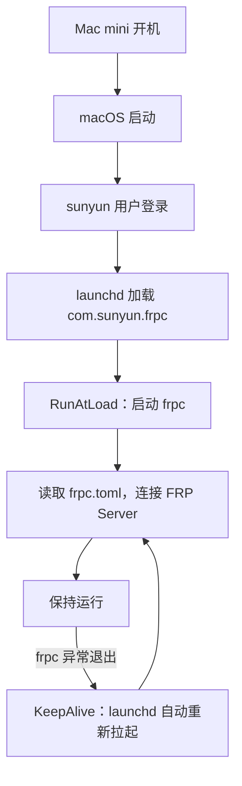

# Mac mini FRPC 开机自动启动（launchd + LaunchAgent）

> Mac mini 上 FRP 客户端 `frpc` 的开机自动启动方案：macOS 原生 `launchd` + 用户级 `LaunchAgent`，**登录自启 + 崩溃自动拉起**。
>
> 本文由 Mac mini 上**实际存在、实际加载、实际运行**的配置整理，可直接用于重装 / 迁移 / 排障。
>
> **安全说明**：`frpc.toml` 含 FRP 服务器地址与认证 token，**不入本仓库**；本目录只留 LaunchAgent 与检查脚本。

## 1. 方案总览



严格说是「**用户登录后自启**」；Mac mini 配置自动登录后，体验等同「开机自启」。它**不是** `/Library/LaunchDaemons`（系统级、未登录前启动）——当前稳定运行，无需迁移。

关键路径速查：

| 项目 | 路径 / 值 |
|---|---|
| 用户 / 设备 | `sunyun` / Mac mini (Apple Silicon) |
| FRP 目录 | `/Users/sunyun/frp_0.59.0_darwin_arm64`（v0.59.0） |
| frpc 可执行文件 | `<FRP 目录>/frpc` |
| frpc 配置 | `<FRP 目录>/frpc.toml`（**不入库**） |
| LaunchAgent | `~/Library/LaunchAgents/com.sunyun.frpc.plist` |
| Label | `com.sunyun.frpc` |
| 日志 | `<FRP 目录>/frpc.log` / `frpc.err.log` |
| 关键开关 | `RunAtLoad=true`、`KeepAlive=true` |

---

## 2. LaunchAgent 配置

完整文件在本仓库：[com.sunyun.frpc.plist](com.sunyun.frpc.plist)，部署时复制到 `~/Library/LaunchAgents/`。字段说明：

| 键 | 值 | 作用 |
|---|---|---|
| `Label` | `com.sunyun.frpc` | 服务名，所有 `launchctl` 命令用它 |
| `ProgramArguments` | `frpc -c frpc.toml`（绝对路径） | 等价手动执行 `frpc -c /Users/sunyun/frp_0.59.0_darwin_arm64/frpc.toml` |
| `RunAtLoad` | `true` | LaunchAgent 加载（登录）时自动启动 |
| `KeepAlive` | `true` | frpc 退出后 launchd **自动重新拉起**，适合无人值守 |
| `WorkingDirectory` | FRP 目录 | 运行工作目录 |
| `StandardOutPath` | `frpc.log` | 标准输出日志 |
| `StandardErrorPath` | `frpc.err.log` | 错误日志（启动异常先看它） |
| `EnvironmentVariables.PATH` | `/usr/local/bin:/usr/bin:…` | LaunchAgent 不继承终端环境，需显式给基础 PATH |

---

## 3. 部署步骤（重装系统 / 新机器）

```bash
# 1. 恢复 FRP 目录，确认本体与配置在位；没有执行权限就补上
ls -lh ~/frp_0.59.0_darwin_arm64/frpc ~/frp_0.59.0_darwin_arm64/frpc.toml
chmod +x ~/frp_0.59.0_darwin_arm64/frpc

# 2. 先手动前台跑一次，确认能连上 FRP Server（Ctrl+C 退出）
cd ~/frp_0.59.0_darwin_arm64 && ./frpc -c ./frpc.toml

# 3. 放置 LaunchAgent（从本仓库复制；用户名不同记得改路径）
mkdir -p ~/Library/LaunchAgents
cp /path/to/network-toolbox/MacMini_FRPC/com.sunyun.frpc.plist ~/Library/LaunchAgents/

# 4. 检查 plist 语法，必须显示 OK
plutil -lint ~/Library/LaunchAgents/com.sunyun.frpc.plist

# 5. 加载并立即启动（现代 macOS 用 bootstrap/kickstart）
launchctl bootstrap gui/$(id -u) ~/Library/LaunchAgents/com.sunyun.frpc.plist
launchctl kickstart -k gui/$(id -u)/com.sunyun.frpc

# 6. 验证
launchctl list | grep com.sunyun.frpc     # 有 PID 即已加载
ps aux | grep '[f]rpc'                    # 应看到完整启动命令
tail -50 ~/frp_0.59.0_darwin_arm64/frpc.log
```

> 已加载的配置：`launchctl list` 输出形如 `2095  1  com.sunyun.frpc`，第一列是 PID。

---

## 4. 日常维护速查

| 操作 | 命令 |
|---|---|
| 是否已加载 | `launchctl list \| grep com.sunyun.frpc` |
| 完整状态（PID / 退出码 / 参数） | `launchctl print gui/$(id -u)/com.sunyun.frpc` |
| 看进程 | `ps aux \| grep '[f]rpc'` 或 `pgrep -af frpc` |
| **重启**（改 `frpc.toml` 后） | `launchctl kickstart -k gui/$(id -u)/com.sunyun.frpc` |
| 实时日志 | `tail -f ~/frp_0.59.0_darwin_arm64/frpc.log` |
| 实时错误日志 | `tail -f ~/frp_0.59.0_darwin_arm64/frpc.err.log` |
| 最近 50 行 | `tail -50 …/frpc.log`（错误看 `frpc.err.log`） |
| **真正停止** | `launchctl bootout gui/$(id -u) ~/Library/LaunchAgents/com.sunyun.frpc.plist` |
| 恢复自启 | `launchctl bootstrap gui/$(id -u) ~/Library/LaunchAgents/com.sunyun.frpc.plist` + `kickstart -k` |

两条关键语义：

- **改 `frpc.toml`**：只需 `kickstart -k`（`-k` = 先结束旧实例再启动），不用重新 bootstrap；
- **改 `.plist`**：必须 `bootout` → `plutil -lint` → `bootstrap` → `kickstart -k`；
- **KeepAlive 注意**：直接 `kill <PID` 会被 launchd 拉起，**真停服务必须 bootout**。

一键体检：[check.sh](check.sh)，把目录、日志、plist 语法、加载状态、进程、日志尾部一次打全：

```bash
./check.sh                       # 默认路径
FRP_DIR=/opt/frp LABEL=com.my.frpc ./check.sh   # 自定义路径 / Label
```

---

## 5. 卸载

```bash
launchctl bootout gui/$(id -u) ~/Library/LaunchAgents/com.sunyun.frpc.plist
rm ~/Library/LaunchAgents/com.sunyun.frpc.plist
```

只删自启配置，FRP 本体目录不受影响。
