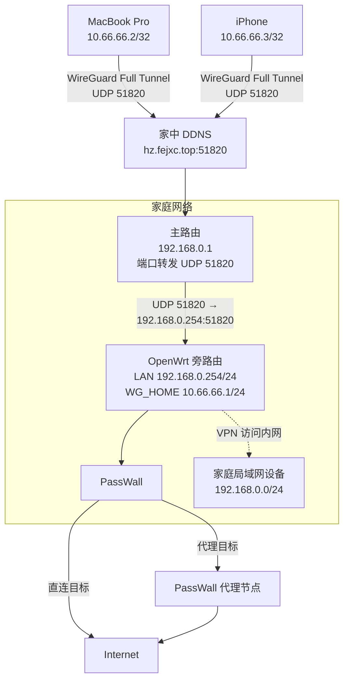
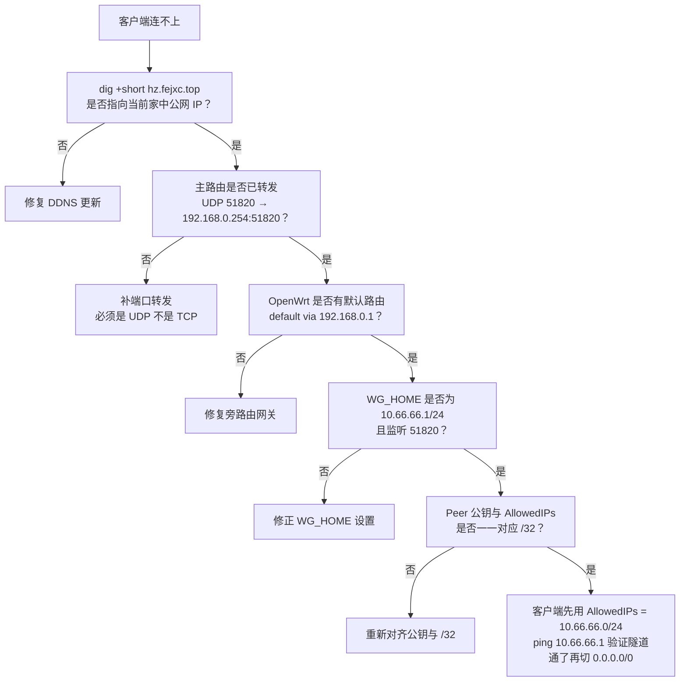

# OpenWrt + WireGuard 远程回家 VPN（Mac / iPhone）

> MacBook / iPhone 在外部网络中通过 WireGuard **Full Tunnel** 回到家中 OpenWrt 旁路由，再由 OpenWrt 上的 PassWall 按原有规则进行直连 / 代理分流。
>
> 本文由**实际验证成功**的配置整理而成，可作为长期部署与扩容的基准文档。
>
> **安全说明：本仓库不保存任何真实私钥。`PrivateKey` / `PublicKey` 一律使用占位符，真实密钥只保存在对应设备中。**

## 目录

- [1. 方案总览](#1-方案总览)
- [2. 地址规划](#2-地址规划)
- [3. 服务端部署（OpenWrt 旁路由）](#3-服务端部署openwrt-旁路由)
- [4. 主路由端口转发与 DDNS](#4-主路由端口转发与-ddns)
- [5. 客户端接入（Mac / iPhone / 新设备）](#5-客户端接入mac--iphone--新设备)
- [6. DNS 与分流（PassWall / Clash Verge）](#6-dns-与分流passwall--clash-verge)
- [7. 验证命令](#7-验证命令)
- [8. 排障](#8-排障)
- [9. 安全须知](#9-安全须知)
- [10. 日常使用](#10-日常使用)

---

## 1. 方案总览



核心分工：

| 层 | 职责 |
|---|---|
| 客户端（Mac / iPhone） | 只负责把全部 IPv4 流量送回家（Full Tunnel） |
| OpenWrt + PassWall | 决定哪些流量直连、哪些流量代理 |

关键参数速查：

| 项目 | 值 |
|---|---|
| WireGuard 隧道网段 | `10.66.66.0/24` |
| 服务端接口 | `WG_HOME`，`10.66.66.1/24`，监听 UDP `51820` |
| 客户端入口 | `hz.fejxc.top:51820`（DDNS，不写死公网 IP） |
| 防火墙区域 | `lan`（入站 / 出站 / 转发均接受） |
| 客户端 DNS | `10.66.66.1`（OpenWrt） |
| `PersistentKeepalive` | `25` |
| MTU | 默认 `1420`；出现「ping 通但 HTTPS/SSH 卡顿」时改 `1380` |

---

## 2. 地址规划

| 设备 | 地址 |
|---|---|
| 家中主路由 | `192.168.0.1` |
| OpenWrt LAN | `192.168.0.254/24` |
| OpenWrt WireGuard（WG_HOME） | `10.66.66.1/24` |
| MacBook Pro | `10.66.66.2/32` |
| iPhone | `10.66.66.3/32` |
| 后续设备 | 从 `10.66.66.4/32` 起继续分配 |

> 公网 IPv4 可能动态变化，客户端**始终使用 DDNS**（`hz.fejxc.top`），不要写死公网 IP。

---

## 3. 服务端部署（OpenWrt 旁路由）

### 3.1 旁路由基础

OpenWrt LAN 设置：

| 项目 | 值 |
|---|---|
| IPv4 地址 | `192.168.0.254` |
| 子网掩码 | `255.255.255.0` |
| IPv4 网关 | `192.168.0.1` |

正确路由应至少包含：

```text
0.0.0.0/0      via 192.168.0.1      dev lan
192.168.0.0/24                      dev lan
```

> **旁路由必须存在 `default via 192.168.0.1`**，否则 WireGuard 即使能收到握手，也可能无法正常回包。

### 3.2 安装 WireGuard

LuCI 路径：`系统 → 软件包`，确认已装：

```text
wireguard-tools
luci-proto-wireguard
```

或 SSH 安装：

```bash
opkg update
opkg install wireguard-tools luci-proto-wireguard
```

### 3.3 创建 WireGuard 服务端接口

LuCI 路径：`网络 → 接口 → 添加新接口`

| 项目 | 值 |
|---|---|
| 接口名称 | `WG_HOME` |
| 协议 | WireGuard VPN |
| PrivateKey | 在 OpenWrt 本机生成（LuCI 一键生成即可） |
| Listen Port | `51820` |
| IP Address | `10.66.66.1/24` |

> **不要开启 DHCP。** 客户端地址由每个 Peer 手动分配（`/32`），不需要 DHCP。

### 3.4 防火墙

把 `WG_HOME` 加入 `lan` 防火墙区域。

LuCI 路径：`网络 → 接口 → WG_HOME → 防火墙设置 → lan`

最终 `lan` 区域包含：`lan`、`WG_HOME`，且入站 / 出站 / 转发均为**接受**。

这样 WireGuard 客户端可以访问：

```text
10.66.66.1        （OpenWrt WG_HOME 自身）
192.168.0.254     （OpenWrt LAN / 管理页面）
家庭局域网设备     （192.168.0.0/24）
```

---

## 4. 主路由端口转发与 DDNS

### 4.1 端口转发

OpenWrt 是旁路由（`192.168.0.254`），WireGuard 的 UDP 流量必须由家中主路由转发：

| 项目 | 值 |
|---|---|
| 协议 | **UDP**（不是 TCP） |
| 外部端口 | `51820` |
| 内部 IP | `192.168.0.254` |
| 内部端口 | `51820` |

数据路径：

```text
Internet → 主路由 192.168.0.1 → 192.168.0.254:51820 → OpenWrt WG_HOME
```

### 4.2 DDNS

客户端统一使用 `hz.fejxc.top:51820`。Mac 上可验证 DDNS 是否指向当前家中公网 IPv4：

```bash
dig +short hz.fejxc.top
```

---

## 5. 客户端接入（Mac / iPhone / 新设备）

### 5.1 密钥原则

```text
每台客户端：独立 PrivateKey + 独立 PublicKey + 独立 /32 地址
PrivateKey 只留在设备本地；PublicKey 填到 OpenWrt 对应 Peer
公钥对应关系：
  客户端 PublicKey → OpenWrt 的该客户端 Peer
  OpenWrt  PublicKey → 客户端配置的 [Peer]
```

密钥生成参考（Mac / Linux / OpenWrt 均可）：

```bash
wg genkey | tee privatekey | wg pubkey > publickey
```

iPhone 直接在 WireGuard App 内 `Add a Tunnel → Create from Scratch` 生成。

> 严禁两台设备共用 `PrivateKey` / `PublicKey` / WireGuard IP。

### 5.2 MacBook Pro

**OpenWrt 添加 Peer**（`网络 → 接口 → WG_HOME → 对端 → 添加对端`）：

| 项目 | 值 |
|---|---|
| Description | `MacBook-Pro` |
| PublicKey | `<MAC_PUBLIC_KEY>` |
| PresharedKey | 留空 |
| Allowed IP | `10.66.66.2/32` |
| Endpoint Host / Port | 留空 |
| 已禁用 | 不要勾选 |

> **服务端 Peer 绝对不要填 `0.0.0.0/0`**，否则 OpenWrt 可能把默认 IPv4 路由错误地指向该客户端。

**客户端分两阶段接入**（模板见 [clients/](clients/)）：

阶段一，先只放行隧道网段，验证基础连通性：

```ini
[Interface]
PrivateKey = <MAC_PRIVATE_KEY>
Address = 10.66.66.2/32

[Peer]
PublicKey = <OPENWRT_PUBLIC_KEY>
Endpoint = hz.fejxc.top:51820
AllowedIPs = 10.66.66.0/24
PersistentKeepalive = 25
```

激活后 `ping 10.66.66.1`，能通说明 `Mac → 公网 → 主路由端口转发 → OpenWrt → WireGuard` 全链路已打通。

阶段二，切换为 Full Tunnel：

```ini
[Interface]
PrivateKey = <MAC_PRIVATE_KEY>
Address = 10.66.66.2/32
DNS = 10.66.66.1

[Peer]
PublicKey = <OPENWRT_PUBLIC_KEY>
Endpoint = hz.fejxc.top:51820
AllowedIPs = 0.0.0.0/0
PersistentKeepalive = 25
```

含义：所有 IPv4 → WireGuard → 家中 OpenWrt。

### 5.3 iPhone

iPhone 必须使用**自己独立的密钥**和 `10.66.66.3/32`，不要复用 Mac 的私钥或地址。

1. iPhone WireGuard App：`Add a Tunnel → Create from Scratch`，生成 iPhone 密钥（私钥只留 iPhone）。
2. OpenWrt 添加 Peer：同 5.2，`Description = iPhone`、`PublicKey = <IPHONE_PUBLIC_KEY>`、`Allowed IP = 10.66.66.3/32`、其余留空。同样**不要填 `0.0.0.0/0`**。
3. App 内最终配置：

| 分组 | 字段 | 值 |
|---|---|---|
| Interface | Addresses | `10.66.66.3/32` |
| Interface | DNS Servers | `10.66.66.1` |
| Peer | Public Key | `<OPENWRT_PUBLIC_KEY>` |
| Peer | Endpoint | `hz.fejxc.top:51820` |
| Peer | Allowed IPs | `0.0.0.0/0` |
| Peer | Persistent Keepalive | `25` |

### 5.4 新增设备

以 Mac mini（`10.66.66.4/32`）为例：

- OpenWrt：新增 Peer，`PublicKey = <MAC_MINI_PUBLIC_KEY>`、`AllowedIPs = 10.66.66.4/32`；
- 客户端：复制 [clients/new-device.conf.template](clients/new-device.conf.template)，替换密钥与地址。

规律：OpenWrt 固定为 `10.66.66.1/24`，每个客户端单独分配一个 `/32`。

---

## 6. DNS 与分流（PassWall / Clash Verge）

### 6.1 DNS

客户端 `DNS = 10.66.66.1`，解析路径：`Mac / iPhone → WireGuard → OpenWrt DNS`。

Mac 验证：`nslookup baidu.com`，正常应看到 `Server: 10.66.66.1`。

### 6.2 PassWall：无需额外配置

实测 WireGuard 客户端流量到达 OpenWrt 后**自动进入现有 PassWall 分流**，因此不需要给 `10.66.66.2` / `10.66.66.3` 设置「绕过 PassWall 强制直连」。

理想数据路径：

```text
客户端 → WireGuard → OpenWrt → PassWall → 按现有规则直连 / 代理
```

### 6.3 Clash Verge：避免双层代理

Mac 使用 WireGuard Full Tunnel 期间，建议关闭本机 Clash Verge 的 **TUN 模式**和**系统代理**，否则可能形成 `Mac Clash → WireGuard → OpenWrt → PassWall` 双层代理。

日常推荐：Mac 只开 WireGuard；代理分流交给家里的 OpenWrt + PassWall。

---

## 7. 验证命令

Mac：

| 检查项 | 命令 | 预期 |
|---|---|---|
| DDNS | `dig +short hz.fejxc.top` | 当前家中公网 IPv4 |
| 隧道网关 | `ping 10.66.66.1` | 可达 |
| 默认 IPv4 路由 | `route -n get 1.1.1.1` | `interface: utunXX`；若仍是 `en0` 说明没走隧道 |
| DNS | `nslookup baidu.com` | `Server: 10.66.66.1` |
| IPv4 出口 | `curl -4 https://api.ipify.org` | 见下方说明 |
| IPv6 泄漏 | `curl -6 --connect-timeout 5 https://api64.ipify.org` | 见 [9.2 IPv6](#92-ipv6-泄漏) |

> IPv4 出口显示 **PassWall 代理节点 IP 而非家中公网 IP 属正常**，它表示路径已是：客户端 → WireGuard → OpenWrt → PassWall → 代理节点。

iPhone：连接 WireGuard 后依次确认——

1. 能否访问家庭内网；
2. 能否打开 `http://192.168.0.254`（OpenWrt 管理页）；
3. 能否正常访问互联网；
4. 浏览器搜索 `what is my ip`，当前出口是否符合 PassWall 规则。

---

## 8. 排障

### 8.1 推荐排障顺序



严格按以下顺序检查：

1. **DDNS**：`dig +short hz.fejxc.top` 是否指向当前公网 IPv4；
2. **主路由端口转发**：UDP `51820` → `192.168.0.254:51820`；
3. **OpenWrt 默认网关**：`192.168.0.254` 必须有 `default via 192.168.0.1`；
4. **WG_HOME**：`10.66.66.1/24`、Listen Port `51820`；
5. **OpenWrt Peer**：Mac `10.66.66.2/32`、iPhone `10.66.66.3/32`；
6. **公钥关系**：客户端公钥 ↔ OpenWrt 对应 Peer，OpenWrt 公钥 ↔ 客户端 `[Peer]`；
7. **先隧道后 Full Tunnel**：先用 `AllowedIPs = 10.66.66.0/24` 确认 `10.66.66.1` 可达，再切 `0.0.0.0/0`。

### 8.2 常见错误

| # | 错误 | 后果 / 现象 | 正确做法 |
|---|---|---|---|
| 1 | 服务端 Peer 填 `0.0.0.0/0` | OpenWrt 可能把默认 IPv4 路由指向客户端 | 服务端 Peer 只填该客户端的 `/32` |
| 2 | 多设备复用同一密钥 / IP | 握手互踢、连接不稳定 | 每台设备独立密钥 + 独立 `/32` + 独立 Peer |
| 3 | 公钥填反 | 无法完成握手 | 客户端公钥 → OpenWrt Peer；OpenWrt 公钥 → 客户端 `[Peer]` |
| 4 | 端口转发用 TCP | 完全连不上 | WireGuard 只用 UDP `51820` |
| 5 | 旁路由没有默认网关 | 握手可能成功但无法回包 | 保留 `default via 192.168.0.1` |
| 6 | 一开始就 Full Tunnel | 出问题难以定位 | 先 `AllowedIPs = 10.66.66.0/24` 验证隧道 |
| 7 | 私钥上传 GitHub / 截图 / 网盘 | 密钥泄漏 | 私钥只留设备本地（见 [9.1](#91-密钥)） |

### 8.3 MTU

Mac 实测 `MTU = 1420` 正常，保持默认。若以后出现「ping 正常，但 HTTPS / SSH 卡顿、部分网站打不开」，在客户端 `[Interface]` 加：

```ini
MTU = 1380
```

---

## 9. 安全须知

### 9.1 密钥

以下内容**禁止**上传到 GitHub、公开网盘、聊天截图、论坛或任何公开配置仓库：

```text
OpenWrt PrivateKey
Mac PrivateKey
iPhone PrivateKey
PresharedKey（如果未来启用）
```

### 9.2 IPv6 泄漏

当前 Full Tunnel 的 `AllowedIPs = 0.0.0.0/0` **只接管 IPv4**。检查方法：

```bash
curl -6 --connect-timeout 5 https://api64.ipify.org
echo
```

| 结果 | 含义 |
|---|---|
| 超时 | 当前没有可用 IPv6，一般不存在 IPv6 绕过 WireGuard |
| 返回外部网络的 IPv6 | IPv4 走 WireGuard、IPv6 直接外放，**属于 IPv6 泄漏** |

只有在 OpenWrt 已正确完成 IPv6 路由、转发和 PassWall IPv6 配置后，才考虑升级为：

```ini
AllowedIPs = 0.0.0.0/0, ::/0
```

---

## 10. 日常使用

**在外**：打开 WireGuard → 自动连接 `hz.fejxc.top:51820` → 全部 IPv4 回家 → OpenWrt + PassWall 分流。

**回家连接家庭 Wi-Fi 后**：通常直接关闭 WireGuard。

---

## 附：配置速查

| 位置 | 配置 |
|---|---|
| 主路由 | LAN `192.168.0.1`；端口转发 UDP `51820` → `192.168.0.254:51820` |
| OpenWrt | LAN `192.168.0.254/24`，网关 `192.168.0.1`；`WG_HOME` `10.66.66.1/24`，Listen `51820`，防火墙区域 `lan` |
| OpenWrt · Mac Peer | `PublicKey = <MAC_PUBLIC_KEY>`，`AllowedIPs = 10.66.66.2/32` |
| OpenWrt · iPhone Peer | `PublicKey = <IPHONE_PUBLIC_KEY>`，`AllowedIPs = 10.66.66.3/32` |
| Mac 客户端 | `Address = 10.66.66.2/32`，`DNS = 10.66.66.1`，`AllowedIPs = 0.0.0.0/0`，`Keepalive = 25` |
| iPhone 客户端 | `Address = 10.66.66.3/32`，`DNS = 10.66.66.1`，`AllowedIPs = 0.0.0.0/0`，`Keepalive = 25` |
