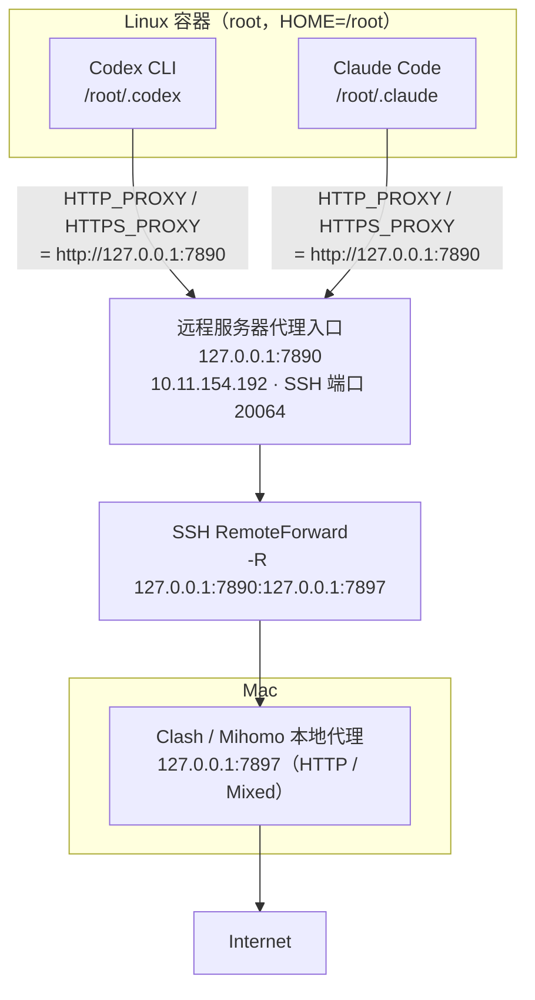
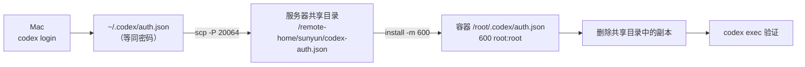
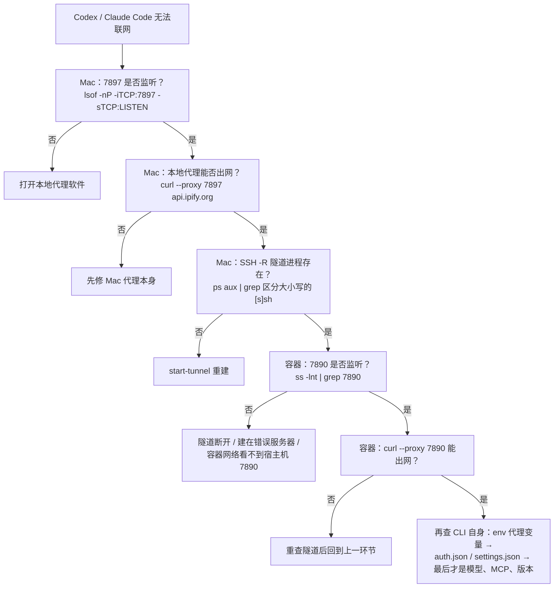

# 远程服务器 Codex + Claude Code + SSH 反向代理

> Mac 本地运行代理，通过 SSH `RemoteForward` 把本地代理反向转发到远程服务器 / Linux 容器，让 Codex CLI、Claude Code、npm、curl 等在远程稳定访问外网。
>
> 本文由**实际配置和排障成功**的环境整理而成，可作为长期部署参照。
>
> **敏感信息说明：Codex `auth.json`、智谱 API Key 等一律不写入本仓库，统一使用占位符。**

## 目录

- [1. 方案总览](#1-方案总览)
- [2. 环境与地址规划](#2-环境与地址规划)
- [3. Mac 端：本地代理与 SSH 反向隧道](#3-mac-端本地代理与-ssh-反向隧道)
- [4. 服务器 / 容器端：代理环境](#4-服务器--容器端代理环境)
- [5. Codex CLI](#5-codex-cli)
- [6. Claude Code](#6-claude-code)
- [7. VS Code Remote SSH](#7-vs-code-remote-ssh)
- [8. 排障](#8-排障)
- [9. 安全规则](#9-安全规则)
- [10. 日常使用](#10-日常使用)

---

## 1. 方案总览



核心是一条**反向映射**：远程服务器上的 `127.0.0.1:7890` 被转发到 Mac 的 `127.0.0.1:7897`。远程程序只需访问 `http://127.0.0.1:7890`，即可借用 Mac 的代理网络出网。

| 层 | 职责 |
|---|---|
| Mac | 运行本地代理（唯一真实出网点）；用 `ssh -R` 把 7897「推」给服务器 |
| 远程服务器 / 容器 | 只暴露 `127.0.0.1:7890`；CLI 通过 `HTTP_PROXY` / `HTTPS_PROXY` 走它 |

关键参数速查：

| 项目 | 值 |
|---|---|
| Mac 本地代理 | `127.0.0.1:7897`（HTTP / Mixed） |
| 服务器代理入口 | `127.0.0.1:7890`（仅回环） |
| SSH | `sunyun@10.11.154.192`，端口 `20064` |
| 保活 | `ServerAliveInterval=30` + `ServerAliveCountMax=3` |
| 转发失败处理 | `ExitOnForwardFailure=yes` |
| Codex 认证 | `/root/.codex/auth.json`（`600`） |
| Claude Code 配置 | `/root/.claude/settings.json`（`600`） |
| 主要项目目录 | `/remote-home/cgrr_train/cgrr` |

---

## 2. 环境与地址规划

| 项目 | 配置 |
|---|---|
| 本地设备 | Mac |
| Mac 本地 HTTP / Mixed 代理 | `127.0.0.1:7897` |
| SSH 用户 / 服务器 / 端口 | `sunyun` / `10.11.154.192` / `20064` |
| 服务器代理入口 | `127.0.0.1:7890` |
| Codex / Claude Code 运行环境 | Linux 容器（用户 `root`，HOME `/root`） |
| Node.js | `/opt/nodejs`（Codex CLI 在 `/opt/nodejs/bin/codex`） |
| Codex 配置目录 | `/root/.codex` |
| Claude Code 配置目录 | `/root/.claude` |
| 主要项目目录 | `/remote-home/cgrr_train/cgrr` |

---

## 3. Mac 端：本地代理与 SSH 反向隧道

### 3.1 检查本地代理

先确认本地代理软件已打开：

```bash
lsof -nP -iTCP:7897 -sTCP:LISTEN          # 确认 7897 在监听
curl --proxy http://127.0.0.1:7897 https://api.ipify.org; printf '\n'   # 返回代理出口 IP 即正常
```

> 如果以后修改了 Clash Verge / Mihomo 的 Mixed Port，需要**同步修改** SSH 隧道里的本地端口 `7897`。

### 3.2 手动启动反向隧道

```bash
ssh -f -p 20064 -N \
  -o ServerAliveInterval=30 \
  -o ServerAliveCountMax=3 \
  -o ExitOnForwardFailure=yes \
  -R 127.0.0.1:7890:127.0.0.1:7897 \
  sunyun@10.11.154.192
```

参数说明：

| 参数 | 含义 |
|---|---|
| `-f` | SSH 认证成功后进入后台 |
| `-N` | 不执行远程 shell，只做端口转发 |
| `-R` | RemoteForward，建立**反向**端口转发（服务器 7890 → Mac 7897） |
| `ServerAliveInterval=30` | 每 30 秒发送 SSH 保活 |
| `ServerAliveCountMax=3` | 连续 3 次无响应才判定连接失效 |
| `ExitOnForwardFailure=yes` | 7890 无法建立监听时 SSH 直接报错退出，而不是「假成功」 |

检查 / 停止 / 重建：

```bash
ps aux | grep '[s]sh.*127.0.0.1:7890:127.0.0.1:7897'   # 隧道是否仍在
pkill -f '127.0.0.1:7890:127.0.0.1:7897'               # 停止
# 重建：重新执行 3.2 的 ssh 命令
```

### 3.3 写入 `~/.ssh/config`（推荐）

```sshconfig
Host codex-server
    HostName 10.11.154.192
    User sunyun
    Port 20064

    RemoteForward 127.0.0.1:7890 127.0.0.1:7897

    ServerAliveInterval 30
    ServerAliveCountMax 3
    ExitOnForwardFailure yes
```

之后 `ssh codex-server` 即自动建立反向代理；VS Code Remote-SSH 连 `codex-server` 时也会一起建立（见 [7](#7-vs-code-remote-ssh)）。

> **注意**：`ssh -R` 手动命令和 `~/.ssh/config` 的 `RemoteForward` 日常**二选一**。两条 SSH 连接同时尝试监听 `127.0.0.1:7890` 会端口占用（后建的那条报错，`ExitOnForwardFailure=yes` 时直接退出）。

### 3.4 一键隧道脚本（跨平台，推荐）

[scripts/start-tunnel.py](scripts/start-tunnel.py) 仅依赖 Python 3 标准库和系统 ssh 客户端，macOS / Linux / Windows 通用（端口探测用 TCP 连接，不依赖 lsof/ss/netstat）：

```bash
# macOS / Linux
python3 scripts/start-tunnel.py              # 后台建立隧道（自动预检本地代理）
python3 scripts/start-tunnel.py --status     # 查看后台隧道状态
python3 scripts/start-tunnel.py --stop       # 停止后台隧道
python3 scripts/start-tunnel.py --watch      # 守护模式：断线自动重连
python3 scripts/start-tunnel.py --foreground # 前台运行，Ctrl+C 停止

# Windows（PowerShell，需已启用 OpenSSH 客户端可选功能）
py scripts\start-tunnel.py --watch
```

适配其它服务器 / 端口：

```bash
python3 scripts/start-tunnel.py --host 1.2.3.4 --port 22 --user me --remote-port 7890 --local-port 7897
```

配置也可用环境变量（命令行参数优先）：`TUNNEL_SSH_HOST` / `TUNNEL_SSH_PORT` / `TUNNEL_SSH_USER` / `TUNNEL_REMOTE_PORT` / `TUNNEL_LOCAL_PORT`。

内置防线：ssh 客户端缺失或本地代理未监听时报错不建隧道；`ExitOnForwardFailure=yes` 保证远程端口被占（隧道已在运行）时立即报错而不是假成功；后台模式把 ssh stderr 记到 `~/.ssh-reverse-tunnel.log` 便于排障。

---

## 4. 服务器 / 容器端：代理环境

> **必须在 Codex / Claude Code 真正运行的容器里操作和测试**，先 `whoami`、`echo "$HOME"` 确认是 `root` / `/root`。

### 4.1 验证端口与链路

```bash
ss -lnt | grep ':7890'                    # 无 ss 则用 netstat -lnt | grep ':7890'
curl --proxy http://127.0.0.1:7890 https://api.ipify.org; printf '\n'
```

`curl` 返回 IP 说明 `容器 → 服务器 7890 → SSH 隧道 → Mac 7897 → Internet` 全链路打通。

### 4.2 代理环境变量

```bash
export HTTP_PROXY=http://127.0.0.1:7890
export HTTPS_PROXY=http://127.0.0.1:7890
export http_proxy=http://127.0.0.1:7890
export https_proxy=http://127.0.0.1:7890
export NO_PROXY=localhost,127.0.0.1,::1
export no_proxy=localhost,127.0.0.1,::1
unset ALL_PROXY all_proxy
```

检查：`env | grep -i proxy`。

> 大小写**同时设置**：不同 CLI、Node.js 包、Python 库对大小写支持不一致。

### 4.3 为什么不用 SOCKS5

- 本地 `7897` 按 **HTTP / Mixed** 代理使用；远程统一暴露 `http://127.0.0.1:7890`。
- 不要同时设 `HTTP_PROXY=http://…` 和 `ALL_PROXY=socks5h://127.0.0.1:7890`，除非确认该端口确实是 SOCKS5。
- Claude Code 尤其适合标准 `HTTP_PROXY` / `HTTPS_PROXY`，而不是 SOCKS5。

### 4.4 写入 `/root/.bashrc`：`proxy_on` / `proxy_off`

模板见 [scripts/bashrc-proxy.sh](scripts/bashrc-proxy.sh)，追加到 `/root/.bashrc` 后 `source` 生效：

```bash
proxy_on    # 开启代理环境变量
proxy_off   # 全部取消
```

### 4.5 Node.js

```bash
export PATH=/opt/nodejs/bin:$PATH
echo 'export PATH=/opt/nodejs/bin:$PATH' >> ~/.bashrc
node -v && npm -v
```

---

## 5. Codex CLI

### 5.1 安装与升级

```bash
proxy_on
npm install -g @openai/codex@latest
hash -r
codex --version && which codex      # /opt/nodejs/bin/codex
```

升级后仍是旧版本时，按序排查：

```bash
type -a codex && which -a codex
readlink -f "$(which codex)"
npm config get prefix && npm root -g
# 仍不行则彻底重装：
npm uninstall -g @openai/codex && npm cache verify
npm install -g @openai/codex@latest && hash -r
```

### 5.2 认证：`auth.json` 分发流程

稳定方案是 **Mac 登录生成 → 上传 → 容器落位**：



**Mac 端**——强制文件认证（`~/.codex/config.toml` 含 `cli_auth_credentials_store = "file"`）：

```bash
grep '^cli_auth_credentials_store' ~/.codex/config.toml
codex logout 2>/dev/null || true
rm -f ~/.codex/auth.json
codex login
ls -lh ~/.codex/auth.json
```

> **不要 `cat ~/.codex/auth.json` 后贴到聊天 / GitHub / Issue / 日志**，该文件等同于密码。

**上传与落位**：

```bash
# Mac：
scp -P 20064 ~/.codex/auth.json \
  sunyun@10.11.154.192:/remote-home/sunyun/codex-auth.json

# 容器：
mkdir -p /root/.codex && chmod 700 /root/.codex
install -m 600 /remote-home/sunyun/codex-auth.json /root/.codex/auth.json
rm -f /remote-home/sunyun/codex-auth.json
stat -c '%a %U:%G %n' /root/.codex/auth.json   # 应为 600 root:root
```

**为什么必须在 `/root/.codex`**：Codex 默认读 `${CODEX_HOME:-$HOME/.codex}/auth.json`；容器内是 `root` / `/root`，所以是 `/root/.codex/auth.json`——**不是** `/remote-home/sunyun/.codex/`，也**不要**放进项目目录。

### 5.3 `config.toml`

模板见 [scripts/codex-config.example.toml](scripts/codex-config.example.toml)。与部署强相关的是：

- `cli_auth_credentials_store = "file"`（文件认证）；
- `[projects."…"] trust_level = "trusted"`（常用项目目录信任）；
- 文件权限 `chmod 600 /root/.codex/config.toml`。

> `model` 等配置会随 Codex 版本或账号可用模型变化，以实际可用为准。

### 5.4 网络与最终验证

```bash
proxy_on
curl --proxy http://127.0.0.1:7890 -I https://api.openai.com
```

返回 `401` / `404` 也**不代表网络问题**——只要收到 HTTP 响应，说明 DNS / TCP / TLS / SSH 代理链路已通。

```bash
codex login status          # 只能说明登录缓存存在
codex exec "只回复 OK"       # 真实请求，返回 OK 才算全链路（代理 ✅ 认证 ✅ token ✅ 模型 ✅）
```

> `login status` 正常 ≠ token 一定有效。

### 5.5 日常启动与一键脚本

```bash
proxy_on
cd /remote-home/cgrr_train/cgrr
git status      # 启动前建议确认工作区状态
codex
```

受控容器 + 可信仓库中也可用 `codex --dangerously-bypass-approvals-and-sandbox`（简写 `--yolo`）：无沙箱 + 无人工审批，**只适合**「可信代码仓库 + 已有外层 Linux / Docker 隔离」的场景。

推荐用一键脚本 [scripts/start-codex-full.sh](scripts/start-codex-full.sh)（装到 `/usr/local/bin/start-codex-full`）：自动设代理变量、检查 `auth.json`、检查代理连通性、再进入项目启动。

### 5.6 `401 token_expired` 处理

典型报错：`HTTP 401 / Provided authentication token is expired / code: token_expired`。

它说明：**网络已通、auth.json 已被读到，只是 token 过期**。不要乱改代理 / MCP / 模型 / SSH，直接刷新认证：

1. Mac：`codex logout → rm -f ~/.codex/auth.json → codex login`；
2. 重新 `scp` 上传并在容器 `install -m 600` 落位（流程同 [5.2](#52-认证authjson-分发流程)）；
3. 重启 Codex，`codex exec "只回复 OK"` 验证。

---

## 6. Claude Code

### 6.1 安装

与 Codex 共用 Node.js、SSH 反向代理和代理环境变量：

```bash
npm install -g @anthropic-ai/claude-code \
  --registry=https://registry.npmmirror.com \
  --include=optional

claude --version && claude doctor
```

升级用 `claude update`，或重跑上面的安装命令；版本没变时 `type -a claude && which -a claude` 查路径。

### 6.2 智谱 GLM（Anthropic 兼容接口）配置

配置文件 `/root/.claude/settings.json`，模板见 [scripts/claude-settings.example.json](scripts/claude-settings.example.json)：

```bash
mkdir -p /root/.claude
# 编辑 settings.json，填入真实 <ZHIPU_API_KEY> 后：
chmod 700 /root/.claude
chmod 600 /root/.claude/settings.json
python -m json.tool /root/.claude/settings.json >/dev/null && echo "JSON OK"
```

核心字段：

| 字段 | 值 |
|---|---|
| `ANTHROPIC_AUTH_TOKEN` | `<ZHIPU_API_KEY>`（真实 Key 不入库） |
| `ANTHROPIC_BASE_URL` | `https://open.bigmodel.cn/api/anthropic` |
| `API_TIMEOUT_MS` | `3000000` |
| `CLAUDE_CODE_DISABLE_NONESSENTIAL_TRAFFIC` | `1` |

> **模型映射**：通常让服务端自动映射即可。确需手动时，在 `env` 中加 `ANTHROPIC_DEFAULT_HAIKU_MODEL` / `ANTHROPIC_DEFAULT_SONNET_MODEL` / `ANTHROPIC_DEFAULT_OPUS_MODEL`，值按智谱 Coding Plan 当时支持的模型填写，不建议写死留存。

### 6.3 使用 SSH 代理验证

```bash
proxy_on
ss -lntp | grep ':7890'

curl -x http://127.0.0.1:7890 -sS -o /dev/null \
  --connect-timeout 10 --max-time 30 \
  -w 'http=%{http_code} total=%{time_total}s\n' \
  https://open.bigmodel.cn/api/anthropic
```

即使返回 `401` / `403` / `404`，只要**快速**返回 HTTP 状态，就说明 SSH 隧道 / HTTP 代理 / DNS / TCP / TLS 至少已正常。

### 6.4 日常启动与一键脚本

```bash
proxy_on
cd /remote-home/cgrr_train/cgrr
claude
```

进入后执行 `/status`，重点确认 **API Base URL** 指向 `https://open.bigmodel.cn/api/anthropic`。

推荐一键脚本 [scripts/start-claude-full.sh](scripts/start-claude-full.sh)（装到 `/usr/local/bin/start-claude-full`）：自动设代理变量、检查 `settings.json`、检查 7890 监听与 GLM API 连通性、再进入项目启动。

### 6.5 直连与代理对比

超时或变慢时，先对比两条路径再下结论：

```bash
# 完全绕过代理
env -u HTTP_PROXY -u HTTPS_PROXY -u ALL_PROXY -u NO_PROXY \
  -u http_proxy -u https_proxy -u all_proxy -u no_proxy \
  curl -sS -o /dev/null --connect-timeout 10 --max-time 30 \
  -w 'DIRECT http=%{http_code} connect=%{time_connect}s total=%{time_total}s\n' \
  https://open.bigmodel.cn/api/anthropic

# 走 SSH 代理
curl -x http://127.0.0.1:7890 -sS -o /dev/null \
  --connect-timeout 10 --max-time 30 \
  -w 'PROXY http=%{http_code} connect=%{time_connect}s total=%{time_total}s\n' \
  https://open.bigmodel.cn/api/anthropic
```

| 结果 | 结论 |
|---|---|
| DIRECT 快，PROXY 慢 | GLM 可以考虑直连 |
| DIRECT 不通，PROXY 正常 | Claude Code 继续走 SSH 代理 |
| 两边都不通 | 检查 DNS / API / 服务端状态 |

> Codex 访问 OpenAI 时仍优先保留 SSH 代理。

---

## 7. VS Code Remote SSH

使用 `Host codex-server`（含 `RemoteForward`）连接时，反向代理随 Remote-SSH 一起建立。

远程 VS Code 设置可加：

```json
{ "http.proxy": "http://127.0.0.1:7890" }
```

> `http.proxy` 主要影响 **VS Code Server 和部分扩展**；Codex CLI / Claude Code 最可靠的方式仍然是 `HTTP_PROXY` / `HTTPS_PROXY` 环境变量。

---

## 8. 排障

### 8.1 网络链路排障（Codex / Claude Code 通用）



**原则：代理测试不通，先修 SSH 隧道；代理测试能通，再查 Codex / Claude Code 自身配置。**

一键验证：

```bash
curl --proxy http://127.0.0.1:7890 https://api.ipify.org
```

### 8.2 Codex 排障清单（按序）

1. Mac 7897 是否监听；
2. Mac 本地代理自己能否访问外网；
3. SSH `-R` 隧道是否存在；
4. 容器 `127.0.0.1:7890` 是否监听；
5. `curl --proxy 127.0.0.1:7890` 是否成功；
6. `HTTP_PROXY` / `HTTPS_PROXY` 是否生效；
7. `whoami` / `$HOME` 是否为 `root` / `/root`；
8. `/root/.codex/auth.json` 是否存在；
9. `auth.json` 权限是否 `600`；
10. `codex login status`；
11. `codex exec "只回复 OK"`。

最后才检查：模型、MCP、VS Code 扩展、项目配置。

### 8.3 Claude Code 排障清单（按序）

1. `claude --version`；
2. `claude doctor`；
3. `~/.claude/settings.json` JSON 是否合法；
4. `ANTHROPIC_BASE_URL` 是否正确；
5. API Key 是否有效；
6. Mac 7897 是否监听；
7. SSH 隧道是否正常；
8. 服务器 7890 是否监听；
9. `curl -x 7890` 能否访问 GLM API；
10. 对比 DIRECT 与 PROXY（见 [6.5](#65-直连与代理对比)）；
11. 再查模型映射 / 429 / 5xx。

### 8.4 超时排查

出现 `API Error / timeout / retrying` 时，**不要第一反应加大 `API_TIMEOUT_MS`**（`3000000 ms` 已是非常大的超时），按序检查：

```text
1. SSH 隧道是否断了              5. API Key 是否有效
2. 127.0.0.1:7890 是否还监听     6. GLM 模型映射是否有效
3. Mac 7897 是否还监听           7. 智谱接口是否 401 / 403 / 429 / 5xx
4. ANTHROPIC_BASE_URL 是否正确   8. Claude Code 是否版本过旧
```

### 8.5 完整检查命令

Mac：

```bash
echo "=== LOCAL PROXY ===";        lsof -nP -iTCP:7897 -sTCP:LISTEN
echo "=== LOCAL PROXY TEST ===";   curl --proxy http://127.0.0.1:7897 https://api.ipify.org; printf '\n'
echo "=== SSH REVERSE TUNNEL ==="; ps aux | grep '[s]sh.*127.0.0.1:7890:127.0.0.1:7897'
```

服务器 / 容器：

```bash
echo "=== USER ===";            whoami; echo "$HOME"
echo "=== REMOTE PROXY PORT ==="; ss -lntp | grep ':7890' || true
echo "=== PROXY ENV ===";       env | grep -i proxy || true
echo "=== PROXY INTERNET TEST ==="
curl --proxy http://127.0.0.1:7890 --connect-timeout 10 --max-time 30 https://api.ipify.org; printf '\n'
echo "=== CODEX ===";           which codex; codex --version; codex login status
echo "=== CLAUDE ===";          which claude; claude --version; claude doctor
```

### 8.6 常见问题

| 现象 | 优先检查 | 常见原因 |
|---|---|---|
| `curl: (7) Failed to connect to 127.0.0.1 port 7890` | Mac 7897 监听 → 隧道进程 → 容器 7890 监听 | Mac 代理关闭 / 隧道断开 / 7890 被占用 / 隧道建在错误服务器 / 容器看不到宿主机端口 |
| 服务器能 curl，CLI 不能联网 | `env \| grep -i proxy`（在 CLI 真正运行的容器里） | 只在 SSH 宿主机 / 其他用户 shell / VS Code 设置里配了代理 |
| Codex `login status` 正常但 401 | 刷新 Mac `auth.json` 并重新上传 | 反复复制了旧文件（见 [5.6](#56-401-token_expired-处理)） |
| Claude Code 一直重试 | 网络 → GLM API → Key → 模型映射 → 429/5xx | 无限加大 `API_TIMEOUT_MS` 而不查根因 |
| npm 安装失败 | `proxy_on` 或换镜像 | `npm config set registry https://registry.npmmirror.com` |

---

## 9. 安全规则

以下内容**不得**提交 Git、放项目目录、贴聊天、发截图、上传公开网盘或写入公开 Markdown：

```text
Codex auth.json
智谱 API Key
Anthropic Token
其他访问 Token
```

权限基线：

```bash
chmod 700 /root/.codex  && chmod 600 /root/.codex/auth.json && chmod 600 /root/.codex/config.toml
chmod 700 /root/.claude && chmod 600 /root/.claude/settings.json
```

---

## 10. 日常使用

日常只需要记住**三个动作**：

| 位置 | 命令 |
|---|---|
| Mac（先开本地代理软件） | `python3 scripts/start-tunnel.py` |
| 服务器容器 · Codex | `start-codex-full` |
| 服务器容器 · Claude Code | `start-claude-full` |

出问题时先测：`curl --proxy http://127.0.0.1:7890 https://api.ipify.org`——不通修隧道，通了再查 CLI 配置（见 [8.1](#81-网络链路排障codex--claude-code-通用)）。

---

## 附：配置速查

| 位置 | 文件 / 命令 |
|---|---|
| Mac 代理 | Clash / Mihomo，`127.0.0.1:7897`（HTTP / Mixed） |
| Mac SSH | `ssh -R 127.0.0.1:7890:127.0.0.1:7897 sunyun@10.11.154.192 -p 20064`，或 `~/.ssh/config` 的 `Host codex-server` |
| 隧道一键脚本（跨平台） | `python3 scripts/start-tunnel.py`（[scripts/start-tunnel.py](scripts/start-tunnel.py)，另支持 `--stop` / `--status` / `--watch`） |
| 容器代理 | `proxy_on` / `proxy_off`（[scripts/bashrc-proxy.sh](scripts/bashrc-proxy.sh)） |
| Codex 认证 | `/root/.codex/auth.json`（600），来源 Mac 登录后 scp（[scripts/codex-config.example.toml](scripts/codex-config.example.toml)） |
| Codex 一键脚本 | `/usr/local/bin/start-codex-full`（[scripts/start-codex-full.sh](scripts/start-codex-full.sh)） |
| Claude Code 配置 | `/root/.claude/settings.json`（600），GLM 兼容接口（[scripts/claude-settings.example.json](scripts/claude-settings.example.json)） |
| Claude 一键脚本 | `/usr/local/bin/start-claude-full`（[scripts/start-claude-full.sh](scripts/start-claude-full.sh)） |
